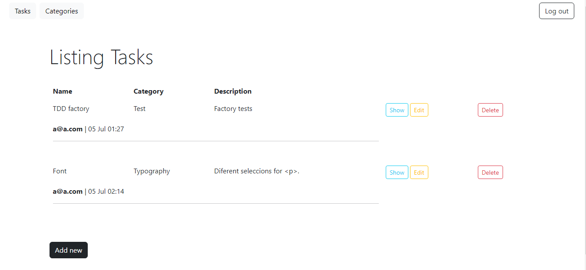

# Tasks Administrations 
A web application to manage tasks and workgroups.

## Characteristics
With this application you can create tasks that have categories, work notes, know who created the task, the team assigned to the task and the date.

## Test
Test with Rspec and Capybara(Models, requests, services)

## Img
|  |  |
|:---:|:---:|
| Task | Add |
 |  |
|:---:|:---:|
| Show | Categories|

## Technology used
- Ruby "3.1.4"
- Rails "7.0.5"
- Bootstrap 5
- Database: "Postgresql"

## License
[MIT](https://choosealicense.com/licenses/mit/)